# MapUp - Python Assessment

## Overview

This assessment is designed to evaluate your proficiency in Python programming, data manipulation, and analysis, as well as your ability to work with Excel. Below, you'll find details on each component of the assessment and the tasks you should complete. Best of luck!

## Important Points to Note:
- The assessment will be tested using our internal set of test cases. Scripts must be developed in accordance with the template shared. Please use the following template to create your scripts:
    - 📂 templates
        - 📄 python_task_1.py
        - 📄 python_task_2.py
- We've clearly outlined the interfaces of our functions, specifying the input and output data types with distinct signatures.
- Any deviation especially in naming conventions and providing arguments will impact the correct assessment of your work

## Submission structure
There should be a folder named `submissions` in the root of your repository. This folder should contain the following:
- 📂 submissions
  - 📄 python_task_1.py
  - 📄 python_task_2.py
  - 📄 excel_assessment.xlsm

## Result Submission:
- Data that you need to work with is in the folder `datasets`. Store your process outputs in the structure mentioned below
- Clone the provided GitHub repository.
- Add the following members as collaborators to your repo
    - `venkateshn@mapup.ai`- [Awaiting response to accept access]
    - `namanjeetsingh@mapup.ai` - [Awaiting response to accept access]
    - `saranshj@mapup.ai` - [Awaiting response to accept access]
    - `varuna@mapup.ai` - [unable to invite as collaborator as it says user already invited but not displaying in the collaborators page]
- Submit the link to your repository via the provided Google Form for evaluation.

 #### Screenshot of collaborator access page
 
 
  
  

## MapUp - Excel Assessment

You have to submit an excel assessment along with your python task. This evaluation tests your proficiency in Conditional Formatting, Excel Formulae, and Data Manipulation

 ## Excel Dataset 
  ### Output
  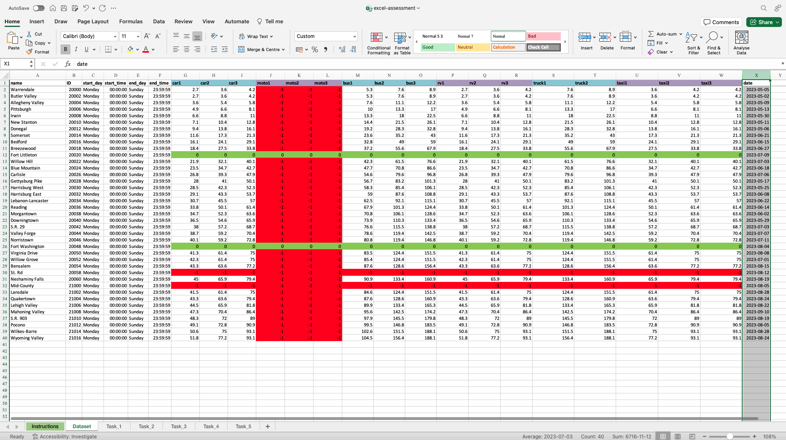
  

 ## Excel Task1 
  ### Output
  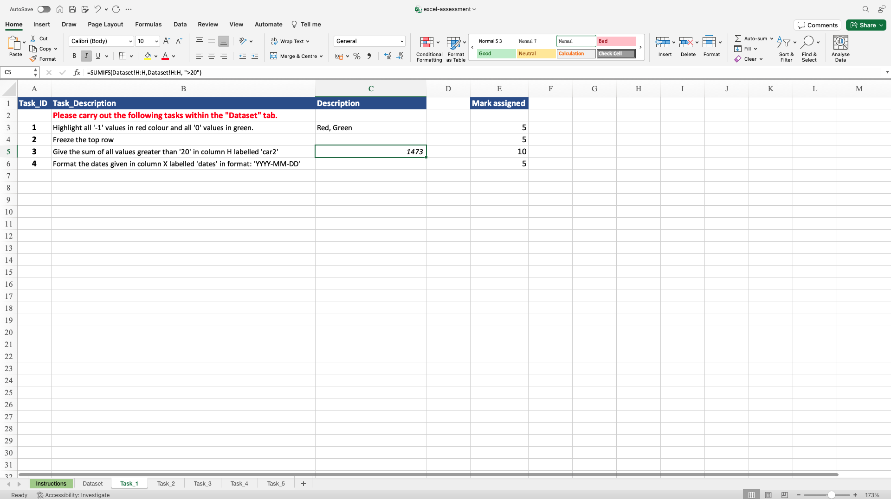

 ## Excel Task2 
   ### Output
  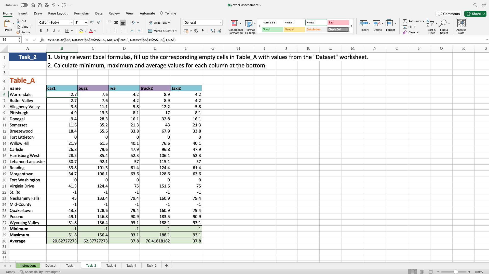

 ## Excel Task3 
   ### Output
  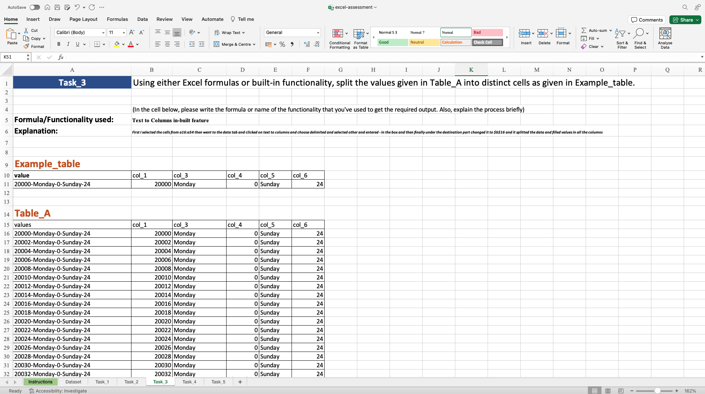

 ## Excel Task4 
   ### Output
  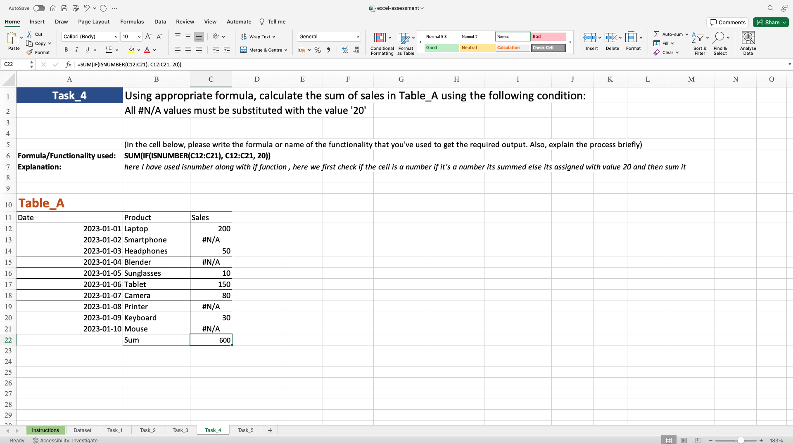

 ## Excel Task5 
   ### Output
  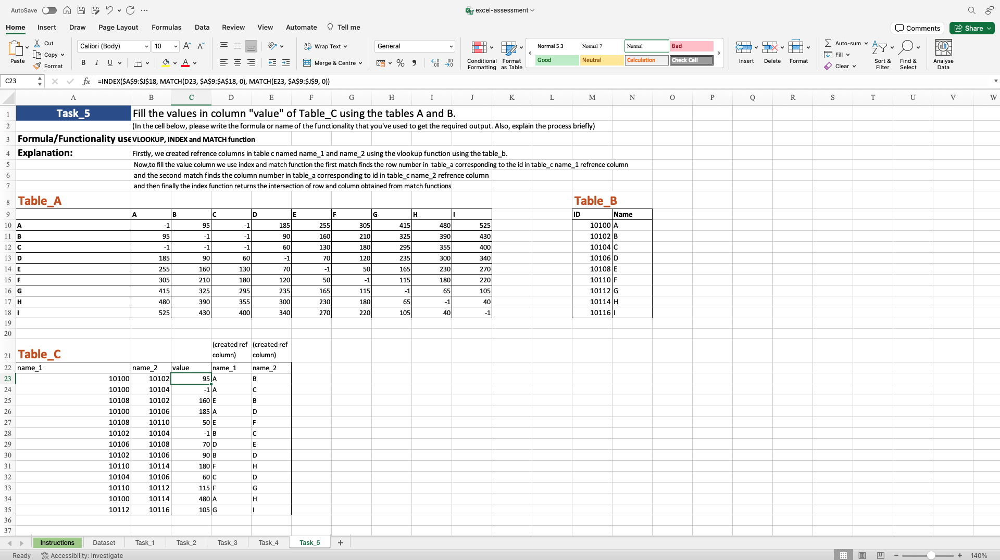

 

# Python Task 1

## Question 1: Car Matrix Generation
Under the function named `generate_car_matrix` write a logic that takes the `dataset-1.csv` as a DataFrame. Return a new DataFrame that follows the following rules:
- values from `id_2` as columns
- values from `id_1` as index
- dataframe should have values from `car` column
- diagonal values should be 0.

Sample result dataframe:\
 

 ## Answer :
 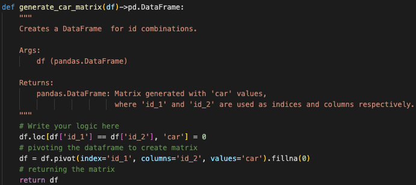

   #### Output
  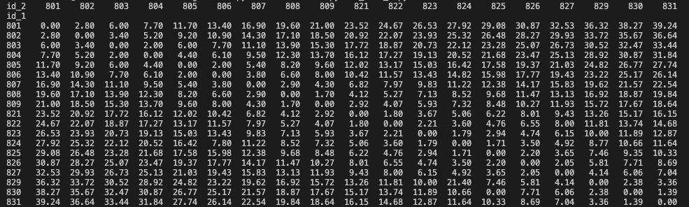

## Question 2: Car Type Count Calculation
Create a Python function named `get_type_count` that takes the `dataset-1.csv` as a DataFrame. Add a new categorical column `car_type` based on values of the column `car`:
- `low` for values less than or equal to 15,
- `medium` for values greater than 15 and less than or equal to 25,
- `high` for values greater than 25.

Calculate the count of occurrences for each `car_type` category and return the result as a dictionary. Sort the dictionary alphabetically based on keys.

 ## Answer :
 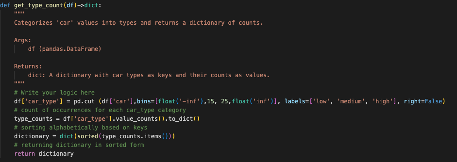
 
   #### Output
  

## Question 3: Bus Count Index Retrieval

Create a Python function named `get_bus_indexes` that takes the `dataset-1.csv` as a DataFrame. The function should identify and return the indices as a list (sorted in ascending order) where the `bus` values are greater than twice the mean value of the `bus` column in the DataFrame.

 ## Answer :
 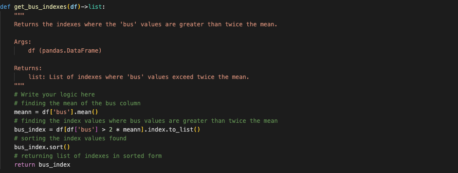

   #### Output
  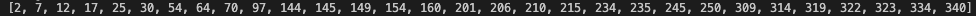

## Question 4: Route Filtering
Create a python function `filter_routes` that takes the `dataset-1.csv` as a DataFrame. The function should return the sorted list of values of column `route` for which the average of values of `truck` column is greater than 7.

 ## Answer :
 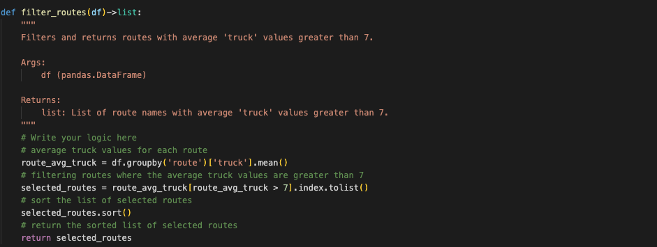

  #### Output
  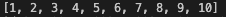
  
## Question 5: Matrix Value Modification

Create a Python function named `multiply_matrix` that takes the resulting DataFrame from Question 1, as input and modifies each value according to the following logic:
- If a value in the DataFrame is greater than 20, multiply those values by 0.75,
- If a value is 20 or less, multiply those values by 1.25.

The function should return the modified DataFrame which has values rounded to 1 decimal place.

Sample result dataframe:\
 

  ## Answer :
 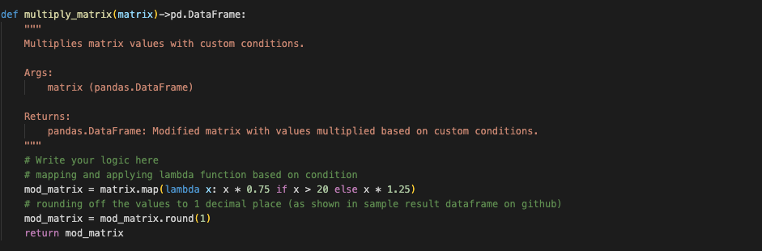

   #### Output
  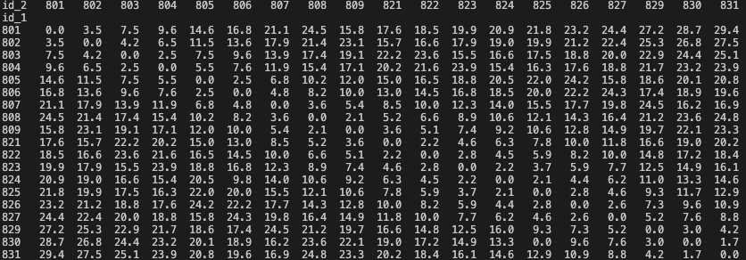

## Question 6: Time Check

You are given a dataset, `dataset-2.csv`, containing columns `id`, `id_2`, and timestamp (`startDay`, `startTime`, `endDay`, `endTime`). The goal is to verify the completeness of the time data by checking whether the timestamps for each unique (`id`, `id_2`) pair cover a full 24-hour period (from 12:00:00 AM to 11:59:59 PM) and span all 7 days of the week (from Monday to Sunday).

Create a function that accepts `dataset-2.csv` as a DataFrame and returns a boolean series that indicates if each (`id`, `id_2`) pair has incorrect timestamps. The boolean series must have multi-index (`id`, `id_2`).

 ## Answer :
 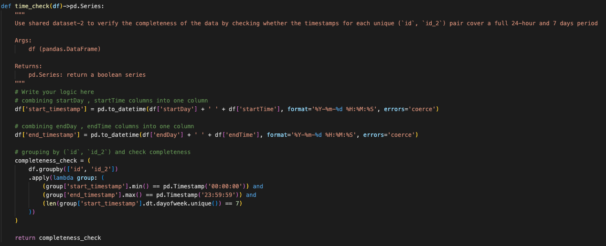

   #### Output
  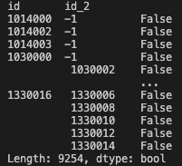

# Python Task 2 

## Question 1: Distance Matrix Calculation

Create a function named `calculate_distance_matrix` that takes the `dataset-3.csv` as input and generates a DataFrame representing distances between IDs. 

The resulting DataFrame should have cumulative distances along known routes, with diagonal values set to 0. If distances between toll locations A to B and B to C are known, then the distance from A to C should be the sum of these distances. Ensure the matrix is symmetric, accounting for bidirectional distances between toll locations (i.e. A to B is equal to B to A). 

Sample result dataframe:\
 

 ## Answer :
 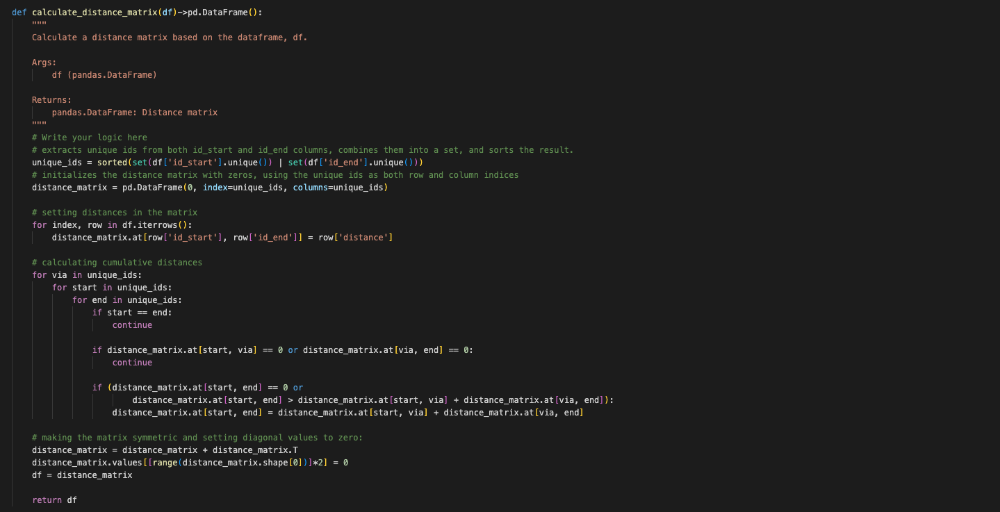

   #### Output
  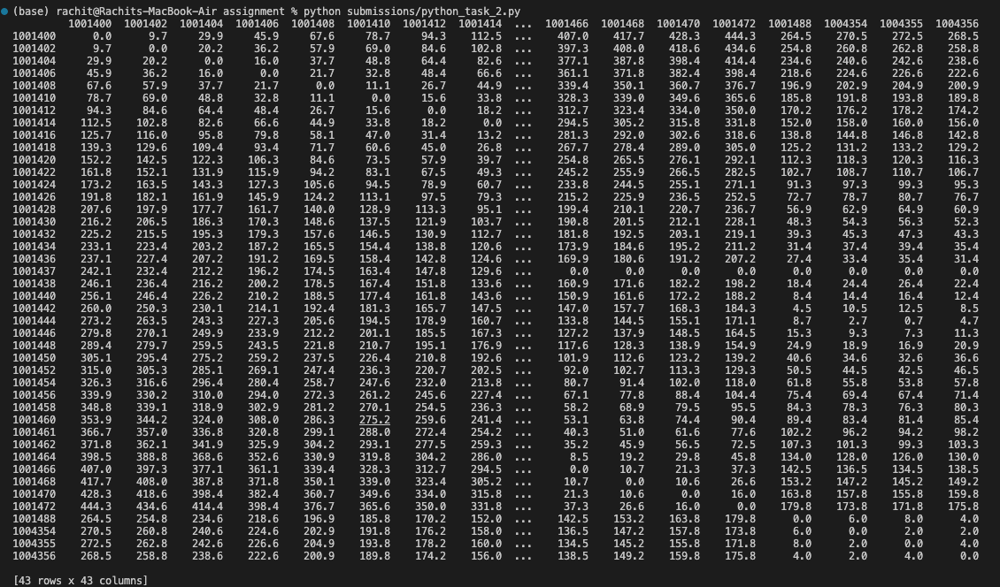

## Question 2: Unroll Distance Matrix

Create a function `unroll_distance_matrix` that takes the DataFrame created in Question 1. The resulting DataFrame should have three columns: columns `id_start`, `id_end`, and `distance`.

All the combinations except for same `id_start` to `id_end` must be present in the rows with their distance values from the input DataFrame.

 ## Answer :
 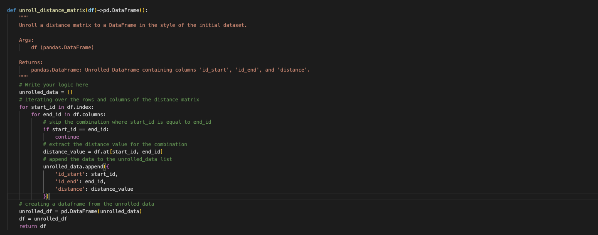

   #### Output
  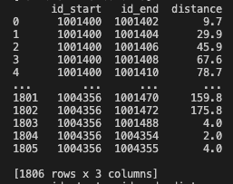

## Question 3: Finding IDs within Percentage Threshold

Create a function `find_ids_within_ten_percentage_threshold` that takes the DataFrame created in Question 2 and a reference value from the `id_start` column as an integer.

Calculate average distance for the reference value given as an input and return a sorted list of values from `id_start` column which lie within 10% (including ceiling and floor) of the reference value's average.

 ## Answer :
 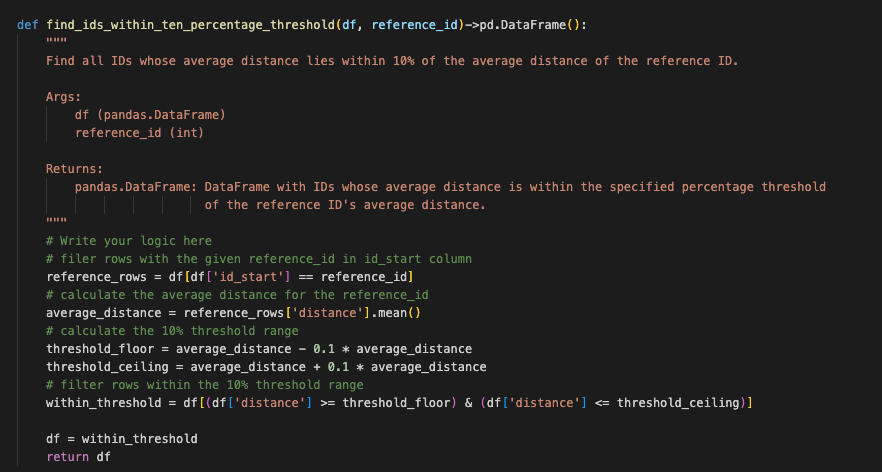

   #### Output
  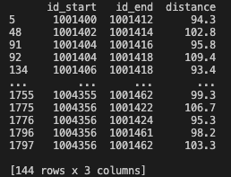

## Question 4: Calculate Toll Rate

Create a function `calculate_toll_rate` that takes the DataFrame created in Question 2 as input and calculates toll rates based on vehicle types. 

The resulting DataFrame should add 5 columns to the input DataFrame: `moto`, `car`, `rv`, `bus`, and `truck` with their respective rate coefficients. The toll rates should be calculated by multiplying the distance with the given rate coefficients for each vehicle type: 
- 0.8 for `moto`
- 1.2 for `car`
- 1.5 for `rv`
- 2.2 for `bus`
- 3.6 for `truck`

Sample result dataframe:\
 

  ## Answer :
 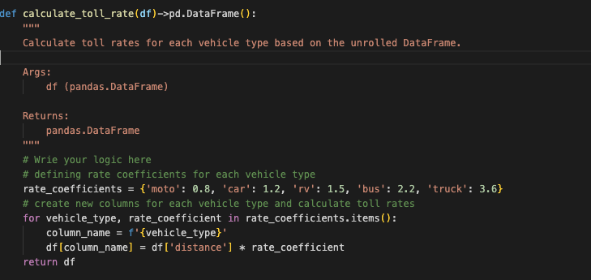

   #### Output
  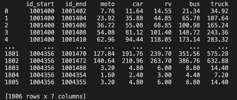

## Question 5: Calculate Time-Based Toll Rates

Create a function named `calculate_time_based_toll_rates` that takes the DataFrame created in Question 3 as input and calculates toll rates for different time intervals within a day. 

The resulting DataFrame should have these five columns added to the input: start_day, start_time, end_day, and end_time.
- `start_day`, `end_day` must be strings with day values (from Monday to Sunday in proper case)
- `start_time` and `end_time` must be of type datetime.time() with the values from time range given below.

Modify the values of vehicle columns according to the following time ranges:

**Weekdays (Monday - Friday):**
- From 00:00:00 to 10:00:00: Apply a discount factor of 0.8
- From 10:00:00 to 18:00:00: Apply a discount factor of 1.2
- From 18:00:00 to 23:59:59: Apply a discount factor of 0.8

**Weekends (Saturday and Sunday):**
- Apply a constant discount factor of 0.7 for all times.

For each unique (`id_start`, `id_end`) pair, cover a full 24-hour period (from 12:00:00 AM to 11:59:59 PM) and span all 7 days of the week (from Monday to Sunday).

Sample result dataframe:\
 

 ## Answer :
 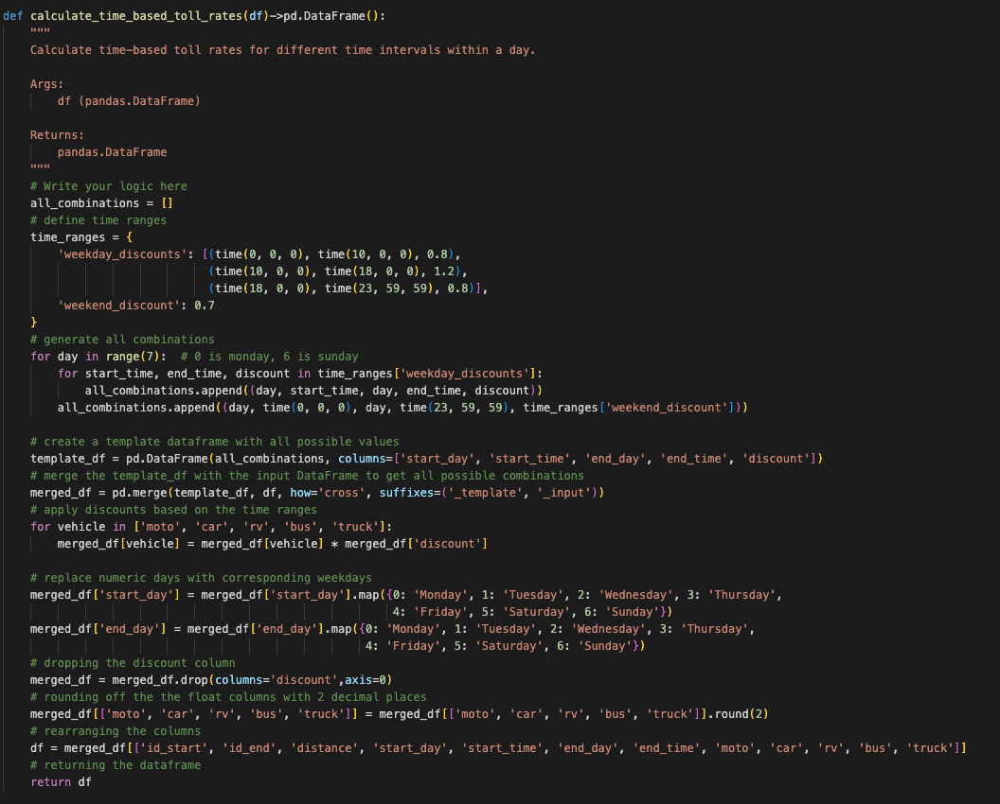

   #### Output
  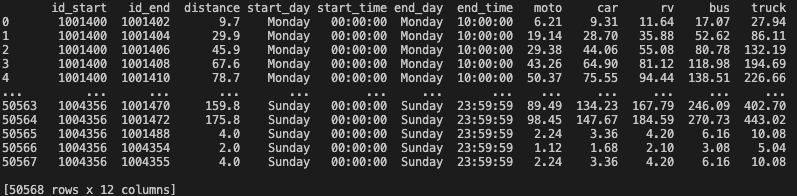
